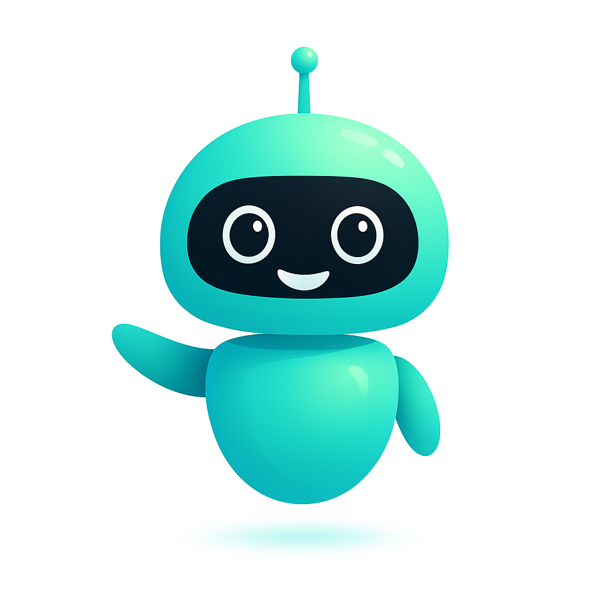

# 📸 Instrucciones para Agregar las Imágenes del Robot y Cerebro

## Pasos para agregar las imágenes:

1. **Coloca las imágenes en la carpeta `frontend/assets/`**
   - Nombre sugerido para el robot: `robot.png` o `robot.svg`
   - Nombre sugerido para el cerebro: `brain.png` o `brain.svg`

2. **Actualiza el archivo `home.html`**
   
   Busca estas líneas en el archivo `home.html`:
   
   ```html
   <!-- Robot -->
   
   ```
   
   Reemplázala con:
   ```html
   
   ```
   
   Y para el cerebro:
   ```html
   <!-- Cerebro -->
   
   ```

3. **Formato recomendado:**
   - Formato: PNG con fondo transparente (preferido) o SVG
   - Tamaño: Mínimo 300x300px, recomendado 512x512px o más
   - Fondo: Transparente para mejor integración visual

## Nota:
Las animaciones CSS ya están configuradas para funcionar con cualquier imagen que agregues. 
Las animaciones incluyen:
- ✨ Flotación suave del robot y cerebro
- 🗣️ Efecto de "hablando" para el robot (ondas de sonido)
- 💡 Efecto de "pensando" para el cerebro (bombilla brillante)

